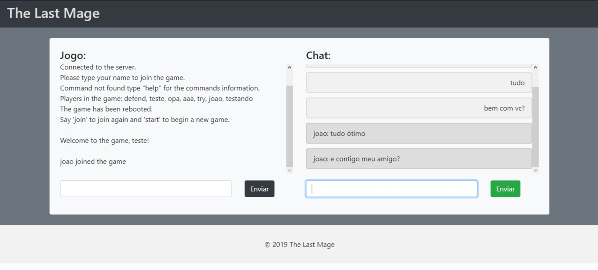

# The Last Mage
Um jogo baseado em turnos em que o vencedor é o último sobrevivente, desenvolvido para atender os requisitos da disciplina Sistemas Distribuídos no 6º período da graduação de Sistemas de Informação na UFU.

**Especificações:**

É um game baseado em turnos com 2 a 4 jogadores.\
Cada jogador pode, em seu turno, optar por:
  - Atacar outro jogador,
  - Defender,
  - Especial (ataque muito forte, limitado a 3 por partida)

O objetivo do jogo é derrotar todos os outros e ser o último sobrevivente.\
Para tanto, cada ataque causa 25 de dano no alvo escolhido, e o ataque especial causa 50 de dano.\
Cada jogador possui inicialmente 100 pontos de vida, e ao se proteger, não recebe dano até seu próximo turno.\
Versões futuras podem ter power-ups ou classes para mudar a habilidade especial dos jogadores.

**Componentes:**

  - 2 a 4 jogadores (clientes)
  - Servidor do jogo
  - Banco de dados próprio

**Screenshots:**

**Comandos:**
  
  - help -> Mostra os comandos do jogo.
  - defend -> Se defender até seu próximo turno.
  - attack [TargetPlayerName] -> Atacar o jogador.
  - specialattack [TargetPlayerName] -> Usar ataque especial no jogador.
  - listplayers -> Lista os jogadores que estão jogando
  - start -> Começar o jogo.
  - reset -> Reinicia o jogo.
  - reboot -> Reinicia o jogo e deleta todos os jogadores (é necessário dar join novamente para jogar).
  - join -> Para participar do jogo.
  - chat [msg] -> Para mandar mensagem no chat.

**Criando o server:**

  - Certifique-se de instalar o Node.Js - https://nodejs.org/en/download/
  - Abra um terminal e clone o repositório - https://github.com/JhonnyBn/TheLastMage.git
  - Abra a pasta do servidor
    - `cd server`
  - Instalar as dependências:
    - `npm install`
  - Iniciar o server:
    - `npm start`
  - Siga a próxima seção para criar clientes
  
**Criando clientes (versão terminal):**

  - Certifique-se de instalar o Node.Js - https://nodejs.org/en/download/
  - Certifique-se que o servidor esteja rodando
  - Abra um terminal e clone o repositório - https://github.com/JhonnyBn/TheLastMage.git
  - Abra a pasta do cliente
    - `cd client`
  - Instale as dependências:
    - `npm install`
  - Inicie o client:
    - `npm start`
  - Abra quantos clientes quiser, um por terminal
  
**Criando clientes (versão web):**

  - Certifique-se de instalar o Node.Js - https://nodejs.org/en/download/
  - Certifique-se que o servidor esteja rodando
  - Abra um terminal e clone o repositório - https://github.com/JhonnyBn/TheLastMage.git
  - Abra a pasta do cliente web
    - `cd client-web/public_front/`
  - Abra o arquivo do cliente-web `index.html` no seu navegador preferido e bom jogo!
  - Abra quantos clientes quiser, um por aba
  
**Testes Automatizados:**

  - Certifique-se de instalar o Node.Js - https://nodejs.org/en/download/
  - Abra um terminal e clone o repositório - https://github.com/JhonnyBn/TheLastMage.git
  - Abra a pasta do servidor:
    - `cd server`
  - Instale as dependências:
    - `npm install`
  - Inicie os testes:
    - `npm test`

